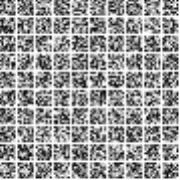

# Self-Organizing-Maps and Image classification

### Bándi Nándor

### January 1, 2021

A self-organizing map (SOM) or self-organizing feature map (SOFM) is a type
of artificial neural network (ANN) that is trained using unsupervised learning to
produce a low-dimensional (typically two-dimensional), representation of the input
space of the training samples, called a map, and is therefore a method to do dimensionality
reduction. My project aims to not only provide a means to do dimensionality 
reduction, but also to classify images. As demonstration the MNIST handwritten
digit dataset is being used. The project also aims to visualize the training progress
of the model by saving intermediate map states.

### Theoretical details

The software enables the use of two types of initialization, random and random
sampling. The model is being trained in a stepwise approximating fashion, that is
at every iteration a random sample is selected from the training dataset.
The learning rateαstarts with a value of 0.9 in every case, and decreases along
the slope of a Gaussian withμ0 andσof the third of the number of maximum
iterations. The neighbourhood function is also a Gaussian whose radius is initialized
in proportion to the size of the map and decreases in a linear fashion to a minimum
of 0.05. The euclidean distance is used as a distance metric. In order to avoid the
phenomenon of exploding gradient the images are being normalized with respect to
the maximal value of their features. Classification is carried out by training a map
for each class. I have experimented with using a single map but it proved to be
inefficient as the different classes are not being properly separated. After training
unseen images are being labeled as their best matching map. For proper testing
I used 5 fold cross-validation. After each validation a confusion matrix is derived
based on which quality metrics such as accuracy, f-score, specificity, sensitivity,
precision and AUC are calculated. Finally confidence intervals with 95% confidence
are provided for these values. The implementation reaches an accuracy of 0.96
± 0. 0049 with 95% confidence in the 8x8 case, and an accuracy of 0.9019± 0. 017 in
the 28x28 case of the MNIST dataset.  
 

### Available flags  
`imagew, imageh` dimensions of the input data  
`mapw, maph` dimensions of the self organizing map  
`gen` training generation count  
`input, test, classCount` input and test filename, label count   
`outputPath` output file that will contain the resulting SOM  (`som.txt`)  

`animation, framecount` enable animation, frame save rate  
`animationPath` path to the directory in which to save the intermediary SOMs.  

### Usage examples  
`./a.out imagew=8 imageh=8 input=optdigits.tra mapw=10 maph=10 `  generates a 10x10 SOM in `som.txt`  
`./a.out imagew=8 imageh=8 input=optdigits.tra mapw=10 maph=10  animationPath=./ framecount=100` will save  100 intermediate SOMs to `.`  
`./a.out imagew=8 imageh=8 input=optdigits.tra test=optdigits.tes mapw=3 maph=3 classCount=10` for classification 

### Implementation details

Environment

The C++ language was chosen due to its high performance and easy CUDA interoperability.
CUDA is being used to parallelize the calculation of distances of a
sample to all of the representative nodes, and to update each representative node
according to the weight update rule. After performing some benchmark tests, I have
found that the CUDA version gains a speedup of a factor of 2. The points are stored
on the device during training to reduce memory traffic, thus further gaining speed.

